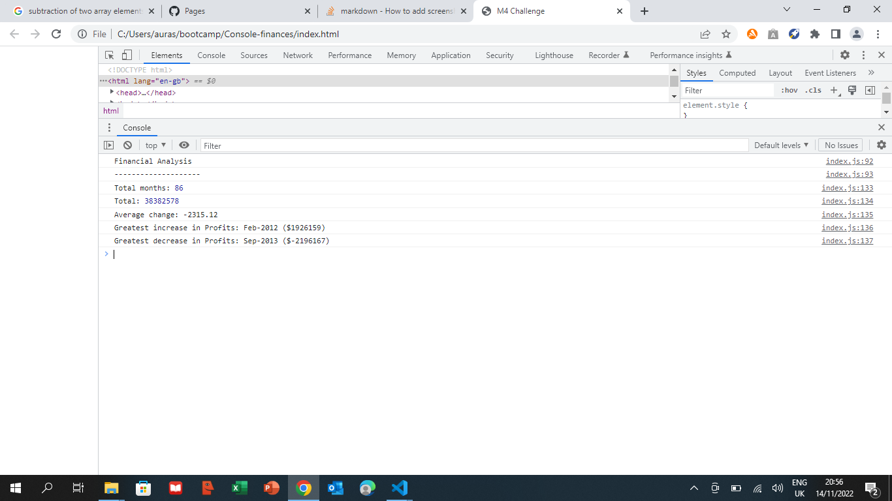

# Console-finances

## Description

This project represents a financial analysis of profits and losses over the period given in the database. The task is to write JavaScript code that analyzes the records to calculate each of the following: the number of months, the total amount, the changes in profits/losses from month to month, the average of these changes and the greatest increase/decrease in profits from those monthly changes.

For this outcome, I've used javascript algorithms including for-loops and if-loops, I subtracted the amount from month to month to find out the monthly changes and i worked with that information to determine the rest of requests. I've mostly used basic algorithms and logical thinking. As there was a bit of confusion regarding the requests, my understanding was that we have to subtract month from month and then find the greatest increase/decrease in profits between these months and not the profit per se.  The outcome will be printed to the console.

## Instalation
The website can be opened in any broswer

https://auraely.github.io/Console-finances/

https://github.com/auraely/Console-finances

## Usage

## Credits

   N/A

## License

  MIT License

